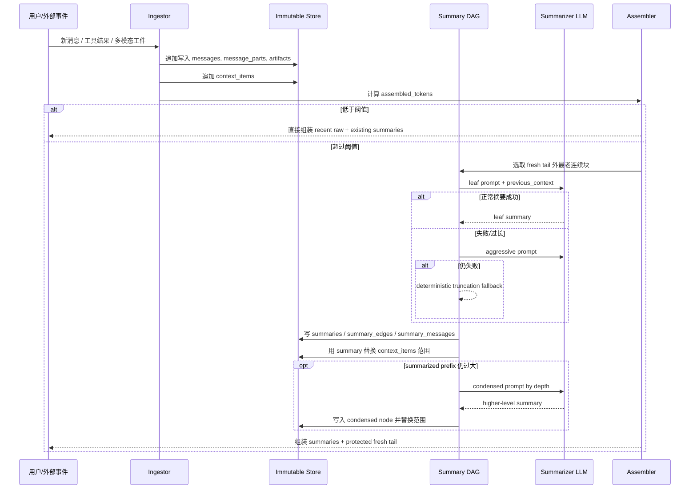
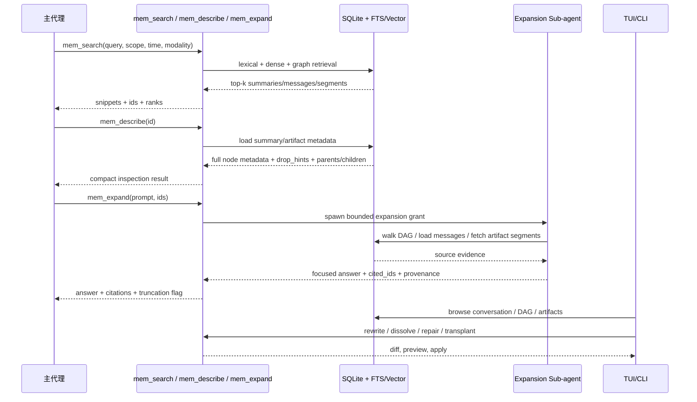

# DAG 多层摘要记忆系统研究报告

## 执行摘要

用 DAG 化、多层、可展开摘要内存替换传统 sliding-window 上下文，是当前构建长程、可恢复、可审计代理记忆系统的一条非常强的工程路径。其核心价值不在于“把历史压得更短”，而在于把
**原始历史、摘要视图、展开权限、检索路径**
拆成不同层次：原始消息永不丢失；摘要只作为物化视图存在；主代理拿到的是成本受控的工作集；当任务需要精确细节时，再通过受限的展开工具或子代理按图回溯到源消息、源文件和源多模态片段。这个思路与
MemGPT 的分层记忆、Generative Agents 的检索/反思机制、LongMem 的外部记忆、RMM/CDMem 的多粒度记忆与图索引方向一致，但在工程上更接近
LCM 和 lossless-claw：前者把它系统化成“引擎托管的递归压缩 + 并行操作符”，后者则把其落到 SQLite、工具链与 TUI/CLI
工作流上。citeturn11search1turn11search0turn11search3turn34view3turn34view4turn16search4turn6search0turn7view0

如果目标是“agentic、multimodal assistant”，我给出的结论是：**最优基线不是单纯的向量记忆，也不是单纯的递归摘要，而是“DAG
摘要 + 原始工件存储 + 多模态分段索引 + 受限展开”的混合架构**。纯 sliding-window
的零管理成本很诱人，但一到多会话、多工具、多文件、多媒体环境，历史信息就会掉出窗口；纯检索式记忆虽然简单，但对跨会话时间推理、任务依赖链、被压缩掉的局部细节恢复能力不稳定；图记忆和事件图记忆能增强逻辑关系建模，但如果没有稳定的原文保真层，仍会面临证据稀疏、摘要漂移和可审计性不足。LongMemEval、LoCoMo、MemoryAgentBench
等近年的评测也说明，长程记忆系统至少要同时面对信息抽取、多会话推理、时间推理、知识更新、选择性遗忘/冲突解决等不同能力维度。citeturn35view0turn34view1turn34view2turn29search2turn32search3turn32search0

对你给出的仓库 `Martian-Engineering/lossless-claw`，我的判断是：它已经是一个非常接近“可用原型/早期生产实现”的文本主导 DAG
内存系统。它具备 SQLite 持久化、summary DAG、阈值驱动/延迟驱动压缩、`lcm_grep`/`lcm_describe`/`lcm_expand_query`
工具、以及用于修复/重写/溶解 DAG 的 TUI/CLI；同时也已经开始处理大文件、图像块和 transcript 重写等现实问题。它的短板主要在两类地方：一类是
**真正统一的多模态语义检索**还没有成为系统一等公民；另一类是**语言与供应商兼容性**，例如公开 issue 已暴露出 CJK 在
`porter unicode61` FTS5 设置下会检索失灵、CJK token 估算失真，以及某些 OpenAI function-call replay 形状在 assemble
后可能重新变成上游无效输入。换句话说，它已经证明了 DAG
压缩记忆是可做的，但离“面向中文、多模态、跨模型、合规可控”的通用记忆层还有明显工程扩展空间。citeturn6search0turn7view0turn3view0turn23view0turn6search4turn24view0turn2search3turn2search9turn2search4

从工程建议上看，最稳的落地顺序是：先做**文本与工具轨迹的 DAG 记忆 MVP**，再把图片/音频/视频作为“工件层”接入，最后再加统一多模态
embedding、图/向量混合检索和合规治理。原因很简单：文本 DAG
决定了系统能不能“记住”；而多模态层决定它能不能“看见和听见”。前者是骨架，后者是器官。骨架先搭稳，后续才不会把系统变成一个记忆力很强但器官排异严重的半成品。citeturn16search4turn7view0turn8view0turn19search1turn19search2turn19search3

## 目标、需求与相关研究

这类系统首先要解决的，不是单次问答，而是**长地平线、多轮、多会话、多工具、多工件**下的上下文治理问题。LCM
论文直接把问题定义为：即使模型标称上下文达到 1M token，真实的 agent 会话也会因工具调用、文件内容、过程态与“context
rot”而在远早于上限的位置发生性能下降；因此，系统需要把“上下文窗口”从唯一记忆改造成某种工作集缓存。Chroma 的 Context Rot
技术报告也指出，随着输入长度增长，模型对上下文的利用并不均匀，而会变得越来越不可靠。LoCoMo 则进一步把问题搬到非常长的多会话对话上：它的数据平均约
300 turns、9K tokens、最长跨 35 个 session，而且包含问答、事件总结与多模态对话生成任务。citeturn17view0turn30search2turn34view1

如果把现有研究按“记忆组织方式”来分，大致可以分为五类。第一类是**上下文内压缩**，代表是递归摘要、prompt
compression、working-set 选择；第二类是**检索增强的长期记忆**，代表是 MemGPT、LongMem、LongMemEval 所抽象出的
indexing/retrieval/reading 三阶段；第三类是**反思式记忆**，如 Generative Agents 的 memory + reflection、RMM 的
prospective/retrospective reflection；第四类是**图结构记忆**，如 A-MEM、CDMem、CompassMem、ContextWeaver；第五类则是*
*引擎托管的层级上下文虚拟化**，代表是 LCM、CMV，以及 demand paging 式的 memory hierarchy
工作。它们不是彼此排斥，而更像不同层的设计拼图。citeturn11search0turn11search1turn11search2turn11search3turn34view3turn34view4turn32search3turn32search0turn16search4turn31search1turn32search2turn35view0

从与你的问题最相关的“DAG 化对话压缩”视角看，直接命中这一主题的公开工作确实不算多，但已经能看到清晰脉络。LCM 明确提出*
*hierarchical summary DAG** 来自动压缩旧消息，同时保留可无损指向每个原件的指针；CMV 把会话历史视为 DAG 状态空间，并以
snapshot/branch/trim 原语管理上下文复用与结构性无损裁剪；ContextWeaver 则把代理轨迹组织成**依赖图**
，强调“后续步骤依赖于哪些早期决定和工具产物”。这三者合并起来，基本就是一个成熟 DAG 记忆系统该有的三条腿：**时间压缩、状态复用、依赖回溯
**。citeturn16search4turn31search1turn32search0

从 lossless-claw 仓库本身看，它已经把很多 LCM 的思想工程化，但实现细节与论文并不完全相同。Repo README 和 architecture
文档说明，它用 SQLite 保存所有消息、以 `context_items` 维护当前模型看到的有序上下文、以 leaf/condensed summaries 形成
DAG，并通过 `lcm_grep`、`lcm_describe`、`lcm_expand_query` 做检索和扩展；而 LCM 论文附录则明确写到其参考实现使用的是嵌入式
PostgreSQL，只要求后端满足事务写入、参照完整性和全文检索即可。这个差异其实很重要：它说明“DAG 多层摘要记忆”并不依赖某一个数据库，而是依赖
**数据模型与操作语义**。换句话说，SQLite 不是这个范式的定义，SQLite
只是其中一个很合理的嵌入式实现点。citeturn6search0turn7view0turn23view0turn36view0

下表把几种典型方案放到同一张桌子上。表格里的“适配度”是综合你的目标场景给出的设计判断，而不是论文原始分数。

| 方案             | 记忆组织                          | 优点                | 核心短板              | 对本项目适配度 | 代表来源                                                         |
|----------------|-------------------------------|-------------------|-------------------|---------|--------------------------------------------------------------|
| Sliding window | 最近消息线性窗口                      | 实现最简单，延迟最低        | 老信息直接掉窗；跨会话与证据恢复弱 | 低       | citeturn6search0turn17view0                              |
| 检索式长期记忆        | 扁平 chunks / facts + retrieval | 部署快，易与现有 RAG 统一   | 缺少依赖结构；证据稀疏时表现不稳  | 中       | citeturn35view0turn29search2                             |
| 图记忆            | 实体/事件/依赖图                     | 多跳与逻辑关系更强         | 维护复杂；若无原文保真层，审计难  | 中高      | citeturn11search2turn32search3turn32search0turn34view4 |
| 分层树摘要          | 多层摘要树                         | 易解释，摘要压力可控        | 交叉引用与复用弱于 DAG     | 高       | citeturn12search4turn12search8turn34view3               |
| DAG 多层摘要记忆     | 摘要 DAG + 可展开原文                | 兼顾压缩、可恢复、可审计、跨层引用 | 实现复杂；摘要治理与检索路由要做细 | 很高      | citeturn16search4turn7view0turn8view0turn31search1     |

对“多模态 assistant”的额外要求，则来自评测而不是美学。LoCoMo
已经把图像共享/反应纳入长程记忆测试，说明现实系统至少不能把多模态输入当成“会话外的附件”；MemoryAgentBench
又把准确检索、测试时学习、长距离理解、选择性遗忘放到了同一框架下，这意味着系统不能只会存，还必须知道**什么时候压缩、什么时候检索、什么时候忽略
**。所以，本项目的功能需求应至少包含：原文保真、层级压缩、按图展开、多模态分段、跨会话检索、时序推理、权限隔离、删除/保留策略、以及可观测性。citeturn34view1turn34view2turn35view0

## 体系结构与核心算法

推荐的总体架构是“五层式”。最底层是**Immutable Event Store**，保存所有消息、消息部件、工具调用、文件引用与多模态片段；第二层是*
*Artifact Store**，保存图像、音频、视频与大块原始内容；第三层是**Summary DAG**，把旧历史压缩成 leaf/condensed 节点并记录
provenance；第四层是**Hybrid Retrieval Layer**，负责 lexical/semantic/graph/time 混合召回；第五层是**Assembler**，按预算把
DAG 节点与最近原始消息组装成模型输入。lossless-claw 的文档已经清楚展示了其中的核心骨架：消息落库、`context_items`
维护当前上下文、leaf summaries 从原始消息生成、condensed summaries 由同深度 summaries 再压成更高层节点、assemble 时再把
summaries + fresh tail 拼回模型看到的消息数组。citeturn7view0turn8view0

在**自动层级摘要**方面，我建议直接采用“阈值触发 + 两阶段 sweep + 三层降级”的算法，因为它兼顾确定性和故障收敛。lossless-claw
的配置文档已经把这个逻辑做得很清楚：`afterTurn()` 只基于 `contextThreshold` 判断是否需要自动压缩；full sweep 先对 fresh
tail 之外的最老原始消息做 leaf pass，直到没有可压块；若 summary prefix 仍高于 `summaryPrefixTargetTokens`，再做
condensation pass；若仍有压力，则允许突破 `sweepMaxDepth` 进入 pressure phase；每次 summarization 都执行 normal →
aggressive → deterministic truncation 的三级降级，确保系统“再差也会前进，不会卡死”。这和 LCM 论文的 guaranteed convergence
思路是一致的。citeturn3view0turn7view0turn17view0

更具体地说，压缩触发条件可以写成一个简单而稳的规则：

```text
若 assembled_tokens > context_threshold × token_budget
    则触发 full sweep
否则不自动压缩
```

而 summary 深度控制可遵循“**先广度，后深度**”原则：优先做 d0 leaf
摘要，尽量把原始历史变成可检索的叶子；只有当叶子摘要自己也开始占据过多预算时，才从浅层往上合并。这背后的经验依据来自两个方向：一是
repo 文档明确指出 routine sweeps 先 leaf 后 condensation；二是 LongMemEval 的结果表明，长期记忆设计可以拆成
indexing、retrieval、reading 三阶段来优化，过早抽象成太高层的“总结之总结”往往不利于后续检索读出。我的建议是：默认
`preferred_max_depth=1 or 2`，只有当摘要前缀明显高于目标预算时才进入深度压缩。citeturn3view0turn8view0turn35view0

**最新消息保护**是这一类系统里最不能犯错的地方。lossless-claw 已经有 `freshTailCount` 和可选的 `freshTailMaxTokens`
，并明确规定“最新消息即便超过 cap 也必须保留”；assemble 时也会把最新原始消息作为 protected fresh tail 精确保留。我的建议是在这个基础上再加三条
pinning 规则：一，最后一个用户消息永远 pin；二，任何未闭合的 tool-use/tool-result 链永远成组 pin；三，当前 turn
相关的多模态附件与其局部解释摘要要共同 pin。这样做的原因很朴素：最近消息往往承载“当前意图”和“当前执行状态”，一旦被过早摘要，不仅会降低回答对齐，还会触发工具
replay、ID 对齐和供应商协议兼容问题。repo issue #46 就是一个现实案例：assemble 后重新引入了某些对 OpenAI Responses 无效的函数调用
ID 形状。citeturn5view4turn8view0turn2search4

如果要把这一套变成真正可展开的 DAG，而不是“递归写摘要”的花架子，节点本身就必须是**可导航对象**。我建议每个 summary 至少带这些字段：
`summary_id`、`conversation_id`、`kind`、`depth`、`earliest_at`、`latest_at`、`token_count`、`source_span_hash`、
`descendant_count`、`drop_hints`、`artifact_refs`、`parent_ids / child_ids`。lossless-claw 在 XML summary 里已经把 `id`、
`kind`、`depth`、`descendant_count`、时间范围和 `<parents>` 暴露给模型，并在 `<content>` 中嵌入 “Expand for details
about ...” 提示；这恰好证明，**摘要不是给人读的短文，而是给代理导航的压缩索引块**。citeturn8view0

下面这张 Mermaid 时序图概括了推荐的 summarization/condensation 流程：



下面这个归一化示意图不是公开基准实测，而是为了把设计权衡说清楚：越往右走，保真与可恢复性通常越高，但系统复杂度和存储开销也上升。

```text
归一化权衡示意（高=更强/更多）

方案                  存储开销      检索/事实保真      实现复杂度
滑窗                  ██           ██               █
单层摘要              ███          ████             ██
分层树摘要            ████         █████            ███
DAG 多层摘要          █████        ███████          █████
DAG + 原文工件 + 向量  ███████      ████████         ███████
```

## 多模态存储与检索

如果系统要从“能记住聊天”升级到“能记住世界”，多模态层必须独立设计，不能只把图片、音频、视频当作一大串 base64
或附件路径塞进消息文本。lossless-claw 的当前实现，已经在这条路上迈出半步：architecture 文档说明它会在超过阈值时把大文件外置到
`largeFilesDir`，生成 exploration summary，再把原消息中的文件块替换成紧凑引用；release notes 还说明它后来专门增加了“将原生用户图像块外置成
image files”的处理。因此，我对仓库当前状态的判断是：它具备**多模态工件外置**能力，但公开文档里还看不到一个完整的**统一多模态
embedding / ANN / reranking** 检索层。这意味着它更像“多模态工件已接入存储”，而不是“多模态语义已成为一等检索对象”。citeturn8view0turn24view0turn6search4

在表示学习上，最务实的做法不是强迫“一模一切”，而是采用**双轨嵌入策略**。第一轨是**文本代理轨**：任何音频和视频都尽量先生成高质量
transcript、OCR 文本、章节/镜头摘要，再作为文本参与 FTS 与文本 embedding；第二轨是**原生模态轨**：图像/音频/视频的关键片段再走共享或近共享的多模态
embedding。CLIP 已经证明文本—图像对齐空间足以支持零样本视觉检索；ImageBind 进一步把图像、文本、音频等六种模态绑进统一
embedding 空间；Whisper 则为音频→文本桥接提供了极强的通用 ASR 基线；VideoCLIP 则说明视频—文本对齐可以通过对比预训练获得有效表示。综合来看，真正稳的系统不是“只存
multimodal embedding”，而是“**文本可回忆 + 原生模态可相似搜索**
”的双保险。citeturn19search0turn19search1turn19search2turn19search3turn19search14

具体到存储格式，我建议把多模态切成**工件（artifact）**与**片段（segment）**两级。工件层保存完整文件和元数据，片段层保存可检索单元。图像可切为整图、区域和
OCR block；音频可切为 speaker turn / utterance；视频至少切为 shot、keyframe 与 transcript span 三套片段。这样设计的原因是，所谓“展开”不该总是把整个
MP4 或 WAV 甩回模型——那简直像把仓库整箱倒进茶杯。更合理的流程是先按 query 找到候选 segment，再根据 segment 回到
artifact、时间范围和对应 DAG 节点。这个思路与 LongMemEval 提出的 indexing/retrieval/reading
三阶段也高度一致。citeturn35view0turn19search1turn19search2turn19search3

在索引上，建议采用三类并行索引。第一类是**词法索引**，用于高精度关键词、路径、报错、配置值、实体名检索；第二类是**稠密向量索引**
，用于语义召回与跨模态匹配；第三类是**图索引**，即 DAG/事件图/依赖图，用于顺着 provenance、时间和逻辑依赖回溯。Faiss
提供大规模高维向量相似搜索能力；HNSW 是非常成熟的近邻图索引；Qdrant、Milvus、pgvector、sqlite-vec 则分别对应专用向量服务、分布式
ANN、PostgreSQL 扩展与本地嵌入式向量扩展。我的建议非常直接：**小规模、单机、边缘部署优先 SQLite + FTS5 + sqlite-vec；中等规模优先
PostgreSQL + pgvector；高写入/高并发/多租户检索服务再考虑 Qdrant 或 Milvus**
。citeturn20search0turn20search1turn10search0turn10search1turn10search5turn10search2turn10search10turn10search3turn10search22

下表是我建议的多模态检索栈对比：

| 任务       | 推荐表示                                            | 推荐索引       | 优点                               | 风险/注意点              | 代表来源                                                     |
|----------|-------------------------------------------------|------------|----------------------------------|---------------------|----------------------------------------------------------|
| 文本/代码/日志 | 原文 + 文本 embedding                               | FTS5 + 向量  | 精确词法与语义兼得                        | 中文分词与 token 估算要单独处理 | citeturn25view0turn26view0turn2search3turn2search9 |
| 图像       | OCR 文本 + CLIP/ImageBind embedding               | 向量 + 元数据过滤 | 查询图像内容、UI 截图、图表都方便               | 仅靠 caption 容易丢布局信息  | citeturn19search0turn19search1                       |
| 音频       | Whisper transcript + 音频 embedding               | 词法 + 向量    | 事实问答走 transcript，声学相似走 embedding | ASR 错误会污染后续摘要       | citeturn19search2turn19search1                       |
| 视频       | transcript + keyframe embedding + shot metadata | 混合检索       | 支持“说了什么”和“画面里有什么”                | 分段质量决定检索质量          | citeturn19search3turn19search1                       |

在检索策略上，最值得采用的是**四段式回忆**。先按 conversation / session / agent / time / modality 做硬过滤；再用 lexical 与
dense 召回 top-k 候选；然后沿 DAG 或事件图向上/向下扩一层，补足前因后果；最后再由 reader model 或 reranker 生成 answer /
citation。LongMemEval 的 session decomposition、fact-augmented key expansion、time-aware query
expansion，本质上都在推动这种“先缩小空间，再按目标展开”的路线；RMM 和 ContextWeaver 也都强调，记忆不是一次性召回若干
chunk，而是按当前任务动态重组可用证据。citeturn35view0turn34view3turn32search0

## 持久化、SQLite 设计与工具工作流

如果把你的目标限定在**单机、嵌入式、对话/代理本地状态**，SQLite 非常有吸引力。官方文档明确说，SQLite
适合设备本地存储、文件归档/数据容器、内部数据库和低写入并发场景；数据库是单文件、跨平台、透明、适合作为 diverse content
的数据容器。与此同时，官方也明确提醒：同一个数据库文件只允许一个 writer；如果是很多客户端跨网络直连同一数据库，或者写入量特别大、数据逼近
TB 级，应该考虑 client/server 数据库。这个判断与你要做的记忆系统高度吻合：**个人代理、本机助手、桌面/移动端、单租户
server-side session memory** 用 SQLite 很合适；而**高并发 SaaS 记忆层**则不应该把 SQLite
当终点。citeturn28view0turn9search6

从并发与可靠性看，WAL 模式是默认优选。SQLite 官方说明 WAL 通常更快，且 readers 不阻塞 writer、writer 也不阻塞 readers；同时指出
WAL 依赖共享内存，因此不适合网络文件系统，而且仍然只有一个 writer。自动 checkpoint 默认在 WAL 达到 1000 pages 时触发。对于
agent memory，这意味着两件事：第一，**WAL 很适合“一个会话一个 writer + 多 reader 检索”**；第二，**你必须把
checkpoint、长事务和批量回填当成一等运维对象**。lossless-claw 的 release notes 也说明，它后来专门补了 migration exclusive
transaction、索引优化和大库 SQLite 调优，恰好印证了这点。citeturn28view1turn24view0turn2search7

lossless-claw 的 SQLite 经验尤其值得直接借鉴。它公开文档已经说明了几个关键表的角色：`messages` 保存消息；`message_parts`
保留消息原始结构；`summaries` 保存 leaf 和 condensed nodes；`summary_messages` 与 `summary_parents` 维护 provenance；
`context_items` 维护当前模型看到的顺序视图；大文件则外置为 `large_files` 记录。它还额外暴露出一个现实问题：当前 FTS5 默认使用
`porter unicode61` 时，对中文/CJK 检索可能失效；而官方 FTS5 文档明确指出，`unicode61` 是默认 tokenizer，`porter` 适合英语词干化，而
`trigram` 能提供通用 substring matching，并天然更适合 CJK 一类没有空格分词的场景。因此，如果这是一个中文优先系统，我会把“*
*不要沿用 `porter unicode61` 作为 summaries/messages 的默认全文索引 tokenizer**
”写进设计红线。citeturn7view0turn2search3turn25view0turn26view0turn26view1

另一个中文部署相关的坑是 token 估算。repo issue 已指出，按 “`ceil(text.length/4)`” 估 token 会严重低估 CJK；而且该误差会连带影响
`freshTailMaxTokens`、leaf chunk 边界、contextThreshold 触发点等关键控制逻辑。这个问题的含义非常直接：一旦你的摘要深度与保护尾部建立在错误的
token 预算上，系统就会在中文环境里“看起来没超，实际上早超了”。因此，生产设计里必须把 token estimation 改成**模型 tokenizer
实测优先，字符启发式仅作兜底**。这不是“优化”；这是避免误触压缩的底线。citeturn2search9turn3view0

下面是我建议的 SQLite schema。它不是对 lossless-claw 现有 schema 的逐字转写，而是面向“DAG + 多模态 + 审计”目标做的扩展版参考设计。

### 建议的 SQLite schema

```sql
PRAGMA journal_mode=WAL;
PRAGMA foreign_keys=ON;

CREATE TABLE conversations (
  conversation_id      INTEGER PRIMARY KEY,
  session_key          TEXT NOT NULL,
  agent_id             TEXT,
  tenant_id            TEXT,
  state                TEXT NOT NULL DEFAULT 'active',   -- active / archived / deleted
  started_at           TEXT NOT NULL,
  last_activity_at     TEXT NOT NULL,
  summary_root_id      TEXT,
  UNIQUE(session_key, state) ON CONFLICT IGNORE
);

CREATE TABLE messages (
  message_id           INTEGER PRIMARY KEY,
  conversation_id      INTEGER NOT NULL REFERENCES conversations(conversation_id),
  seq                  INTEGER NOT NULL,
  role                 TEXT NOT NULL,                    -- user / assistant / system / tool
  content_text         TEXT,                             -- 平面文本提取
  token_count          INTEGER NOT NULL DEFAULT 0,
  created_at           TEXT NOT NULL,
  raw_json             BLOB,                             -- 原始 provider payload，可选 JSON/JSONB
  large_content_ref    TEXT,                             -- 指向 artifact/file
  UNIQUE(conversation_id, seq)
);

CREATE TABLE message_parts (
  part_id              INTEGER PRIMARY KEY,
  message_id           INTEGER NOT NULL REFERENCES messages(message_id) ON DELETE CASCADE,
  ordinal              INTEGER NOT NULL,
  modality             TEXT NOT NULL,                    -- text / image / audio / video / tool_call / tool_result / reasoning / file
  mime_type            TEXT,
  text_content         TEXT,
  artifact_id          TEXT,
  time_start_ms        INTEGER,
  time_end_ms          INTEGER,
  bbox_json            TEXT,
  part_json            BLOB,
  UNIQUE(message_id, ordinal)
);

CREATE TABLE summaries (
  summary_id           TEXT PRIMARY KEY,                 -- sum_xxx
  conversation_id      INTEGER NOT NULL REFERENCES conversations(conversation_id),
  kind                 TEXT NOT NULL,                    -- leaf / condensed / synthetic / repair
  depth                INTEGER NOT NULL,
  content              TEXT NOT NULL,
  token_count          INTEGER NOT NULL,
  earliest_at          TEXT,
  latest_at            TEXT,
  descendant_count     INTEGER NOT NULL DEFAULT 0,
  source_span_hash     TEXT,
  drop_hints           TEXT,                             -- 如“error text omitted; full path omitted”
  created_at           TEXT NOT NULL,
  summarizer_model     TEXT,
  status               TEXT NOT NULL DEFAULT 'ready'
);

CREATE TABLE summary_message_edges (
  summary_id           TEXT NOT NULL REFERENCES summaries(summary_id) ON DELETE CASCADE,
  message_id           INTEGER NOT NULL REFERENCES messages(message_id) ON DELETE CASCADE,
  ordinal              INTEGER NOT NULL,
  PRIMARY KEY(summary_id, message_id)
);

CREATE TABLE summary_summary_edges (
  parent_summary_id    TEXT NOT NULL REFERENCES summaries(summary_id) ON DELETE CASCADE,
  child_summary_id     TEXT NOT NULL REFERENCES summaries(summary_id) ON DELETE CASCADE,
  ordinal              INTEGER NOT NULL,
  PRIMARY KEY(parent_summary_id, child_summary_id)
);

CREATE TABLE context_items (
  conversation_id      INTEGER NOT NULL REFERENCES conversations(conversation_id),
  ordinal              INTEGER NOT NULL,
  item_type            TEXT NOT NULL,                    -- message / summary
  message_id           INTEGER,
  summary_id           TEXT,
  pinned               INTEGER NOT NULL DEFAULT 0,
  PRIMARY KEY(conversation_id, ordinal)
);

CREATE TABLE artifacts (
  artifact_id          TEXT PRIMARY KEY,                 -- file_xxx / img_xxx / aud_xxx / vid_xxx
  conversation_id      INTEGER REFERENCES conversations(conversation_id),
  source_message_id    INTEGER REFERENCES messages(message_id),
  modality             TEXT NOT NULL,                    -- image / audio / video / file
  file_name            TEXT,
  mime_type            TEXT,
  byte_size            INTEGER,
  sha256               TEXT NOT NULL,
  storage_uri          TEXT NOT NULL,                    -- 文件路径或对象存储 URI
  exploration_summary  TEXT,
  created_at           TEXT NOT NULL
);

CREATE TABLE artifact_segments (
  segment_id           TEXT PRIMARY KEY,
  artifact_id          TEXT NOT NULL REFERENCES artifacts(artifact_id) ON DELETE CASCADE,
  ordinal              INTEGER NOT NULL,
  segment_type         TEXT NOT NULL,                    -- page / region / utterance / shot / frame / clip
  text_proxy           TEXT,
  time_start_ms        INTEGER,
  time_end_ms          INTEGER,
  region_json          TEXT,
  created_at           TEXT NOT NULL
);

CREATE TABLE embeddings (
  embedding_id         INTEGER PRIMARY KEY,
  owner_type           TEXT NOT NULL,                    -- message / summary / artifact_segment
  owner_id             TEXT NOT NULL,
  model_name           TEXT NOT NULL,
  vector_blob          BLOB NOT NULL,                   -- float32/float16/int8 packed bytes
  dim                  INTEGER NOT NULL,
  norm                 REAL,
  created_at           TEXT NOT NULL
);

CREATE INDEX idx_messages_conv_seq ON messages(conversation_id, seq);
CREATE INDEX idx_summaries_conv_depth_kind ON summaries(conversation_id, depth, kind);
CREATE INDEX idx_context_items_conv_ord ON context_items(conversation_id, ordinal);
CREATE INDEX idx_artifacts_conv_modality ON artifacts(conversation_id, modality);
CREATE INDEX idx_segments_artifact_ord ON artifact_segments(artifact_id, ordinal);

-- 建议采用 external-content 或 contentless FTS 以节省空间
CREATE VIRTUAL TABLE messages_fts USING fts5(
  content_text,
  content='messages',
  content_rowid='message_id',
  tokenize='trigram'
);

CREATE VIRTUAL TABLE summaries_fts USING fts5(
  content,
  content='summaries',
  content_rowid='rowid',
  tokenize='trigram'
);
```

这个 schema 背后的原则是：**正文与工件分离、摘要与原文分离、索引与事实分离**。SQLite 官方文档明确指出，FTS5 支持
external-content 和 contentless tables，可以减少空间占用；JSON/JSONB 函数与 generated columns
也可用于把结构化字段暴露成可索引列。但要注意，SQLite
的强项是嵌入式事务与单机文件容器，不是重写入多租户服务总线。citeturn25view0turn26view0turn27search0turn27search3turn27search5turn27search11turn28view0

如果规模再扩大，推荐的替代路线如下：

| 方案                         | 适用规模                     | 优点                 | 主要代价           | 代表来源                                               |
|----------------------------|--------------------------|--------------------|----------------|----------------------------------------------------|
| SQLite + FTS5 + sqlite-vec | 单机、边缘、桌面、本地 agent        | 部署最轻，数据可携带，审计简单    | 单 writer、横向扩展弱 | citeturn28view0turn10search3turn25view0       |
| PostgreSQL + pgvector      | 中等规模、多用户、服务端记忆           | 事务/并发/SQL 生态成熟     | 运维比 SQLite 重   | citeturn10search0                               |
| Qdrant                     | 大规模向量检索 + payload filter | 向量与 payload 过滤结合好  | 需额外维护服务        | citeturn10search1turn10search5turn10search21  |
| Milvus                     | 大规模 ANN、索引类型丰富           | HNSW / IVF_PQ 等选择多 | 组件更重，复杂度更高     | citeturn10search2turn10search10turn10search22 |

在工具设计上，我建议保留并扩展 lossless-claw 的三级升级范式：**grep → describe → expand**。repo 文档已经把它写得很成熟：
`lcm_grep` 负责广域搜索，`lcm_describe` 负责查看具体 summary/file 的完整内容和元数据，`lcm_expand_query` 通过受限子代理做深度展开；低层
`lcm_expand` 则仅对子代理开放。这个模式之所以强，是因为它把“成本最小的搜索”和“最贵的上下文展开”明确分层，不会动不动把整个历史翻出来暴打模型。对于多模态版本，我建议对应扩展为：

- `mem_search`：跨 messages / summaries / artifact_segments 搜索
- `mem_describe`：查看 summary、artifact 或 segment 元数据
- `mem_expand`：按 DAG / segment / time-range 展开
- `mem_trace`：追踪某个答案用到了哪些 summary、messages、segments
- `mem_rewrite`：重写摘要或子树
- `mem_dissolve`：撤销一次合并
- `mem_compact_now`：手工触发 sweep

这些基本上就是把 lossless-claw 的现有哲学推广到 multimodal memory。citeturn23view0turn6search4

对应的 UI/CLI 也应该分成两条面：一条是给 agent 的工具协议，一条是给人类运维的 inspection 面板。lossless-claw 的 TUI
已经很好地展示了后者该长什么样：会话浏览、Summary DAG、Context view、large files
查看、rewrite/repair/dissolve/transplant/backfill、prompt template 管理等都已经具备。我建议多模态版本在此基础上再加三个面板：
**时间轴 panel**、**工件 panel**、**证据链 panel**。这样当系统答错时，人可以很快看到它究竟是没找到图、没读到字幕，还是顺着错的
DAG 分支展开了。citeturn6search4turn23view0

下面这张 Mermaid 图概括了建议的展开与 UI 工作流：



## 评估、安全与实施路线

评估这类系统，不能只看“最后答对没答对”，而必须把**记忆质量、展开质量、组装代价、存储代价**
分别量化。我建议至少跟踪八类指标：摘要忠实度、证据召回率、展开命中率、时间推理正确率、组装延迟、展开延迟、单位会话存储开销、以及跨会话污染率。LongMemEval
已经把长期记忆能力拆成信息抽取、多会话推理、时间推理、知识更新与 abstention；LoCoMo 额外加入事件总结和多模态对话生成；MemoryAgentBench
则强调准确检索、测试时学习、长距离理解与选择性遗忘。这几个 benchmark 加在一起，已经足够覆盖大多数“记忆系统，不只是大上下文
prompt”该测的东西。citeturn35view0turn34view1turn34view2

用于工程验收时，我建议把测试分成四层。第一层是**离线 transcript replay**：给定完整真实历史，重放每一
turn，比较不同阈值、不同深度、不同新鲜尾保护策略下的 assembled context。第二层是**oracle expansion 测试**：随机抽取
leaf/condensed nodes，要求系统能回到其 source messages / artifact segments，并计算 evidence recall。第三层是**任务级
benchmark**：跑 LongMemEval、LoCoMo、MemoryAgentBench，以及你自己的业务 replay 集。第四层是**协议与回归测试**：专门覆盖
tool-call pairing、provider payload replay、CJK FTS、token budget 边界、音频转写误差传播等实际失败模式。repo 公开 issue
里已经给出了两个该重点覆盖的回归类：OpenAI function-call replay 形状问题，以及中文 FTS
检索失灵。citeturn2search4turn2search3turn35view0turn34view1turn34view2

下面这张额外的归一化图，用来说明“摘要深度”不是越深越好。深度提高会降低 assemble 时占用，但会提高 expand 成本与摘要漂移风险。

```text
摘要深度权衡示意（归一化）

深度/策略            组装成本(低更好)   展开成本(低更好)   事实漂移风险(低更好)
只保留原文            ███████            █                 █
leaf only            ████               ██                ██
leaf + d1            ███                ███               ███
leaf + d1 + d2       ██                 ████              ████
过深压缩             █                  ███████           ██████
```

安全与隐私方面，这类系统不能只谈“加密”，而必须把**访问边界、最小化原则、删除语义、审计语义**一起设计。NIST AI RMF 明确建议采用
privacy-enhancing technologies、数据最小化、去标识与聚合等技术；NIST Privacy Framework 则把隐私风险识别和治理本身当成产品能力；GDPR
第 5 条则把 lawful/fair/transparent、purpose limitation、data minimization、storage limitation
作为处理个人数据的基本原则。对记忆系统来说，这意味着至少要做到：只存未来可能有用的最小必要数据；支持按用户/会话/租户删除原文和派生摘要；保留审计日志但不泄露内容；默认不持久化不必要的内部推理文本。citeturn21search0turn21search4turn21search16turn21search14

权限模型上，lossless-claw 的 expansion grant 设计非常值得直接继承。它把 delegated expansion 限定在 conversation
scope、token cap、TTL 和 revoke-on-completion 之下，并明确禁止递归地再开放 `lcm_expand_query` 给子代理。这种“*
*只允许子代理在指定作用域内读，不允许主代理随意把整个历史 inline 展开**
”的做法，非常适合多模态系统，因为图片、视频和大文件一旦失控展开，代价会比文本糟糕得多。对生产系统来说，我会再补三层：artifact 级
ACL、租户级 envelope encryption、以及查询级 provenance log。citeturn8view0turn23view0turn21search23

关于加密，SQLite 本身不是加密数据库；如果设备遗失或文件被复制，明文记忆库就像把日记本钉在门外。SQLCipher 提供透明 256-bit
AES 全库加密、tamper-resistant design、memory sanitization 与强 KDF，是 SQLite 场景里很自然的 at-rest 方案。我的建议是：本地/边缘设备默认
SQLCipher；服务端则使用磁盘加密 + 应用层密钥封装 + 分租户 key rotation。citeturn21search23turn21search3

在可配置参数与 UX 上，最应该暴露给用户/运维的阈值，不要太多，但必须是“真正改变行为”的参数。lossless-claw 文档里最有代表性的包括：
`contextThreshold`、`freshTailCount`、`freshTailMaxTokens`、`promptAwareEviction`、`leafMinFanout`、`condensedMinFanout`、
`sweepMaxDepth`、`leafChunkTokens`、`summaryPrefixTargetTokens`、`maxSweepIterations`、`sweepDeadlineMs`、
`delegationTimeoutMs`、`summaryTimeoutMs` 等。我建议产品层只公开四类旋钮：**记忆激进度**、**最近消息保护**、**多模态保留策略
**、**搜索偏好**；其余高级参数放到“专家模式”，否则普通用户只会被一大堆阈值淹没。citeturn3view0turn5view4

可以把用户可调参数整理成下面这种 UX 模型：

| UX 名称  | 内部映射                                                             | 建议默认值 | 用户能感知到的效果         | 依据                            |
|--------|------------------------------------------------------------------|-------|-------------------|-------------------------------|
| 记忆激进度  | `contextThreshold`、`leafChunkTokens`、`summaryPrefixTargetTokens` | 中等    | 更省 token vs 更保守原文 | citeturn3view0             |
| 最近消息保护 | `freshTailCount`、`freshTailMaxTokens`                            | 保守    | 最新对话更稳定，但成本更高     | citeturn5view4turn8view0  |
| 主题感知组装 | `promptAwareEviction`                                            | 关闭    | 老话题回忆更好，但缓存命中更差   | citeturn3view0             |
| 深度展开预算 | `delegationTimeoutMs`、`maxTokens`                                | 中等    | 回忆更全 vs 等待更久      | citeturn23view0turn3view0 |

实施路线方面，我建议按三个版本走。**MVP 版**只做文本/工具轨迹 DAG、SQLite、FTS5、`search/describe/expand`、以及 replay
eval，这一版就能替换 sliding-window；**增强版**加入 artifacts、大文件、图片、音频 transcript、视频分段与 TUI；**生产版**
再加入统一多模态向量检索、权限隔离、加密、删除治理和多后端数据库切换。以一个 3 人小组估算，MVP 大约 4–6 周；增强版再加 6–8
周；生产版硬化与合规再加 8–12 周。换句话说，**三个月能做出很像样的 pilot，五到七个月能做出不太会在半夜把你叫醒的生产版本**
。这不是精确科学，但比“很快就能做完”诚实得多。

| 阶段  | 主要组件                                                         |  预估工作量 | 输出                        |
|-----|--------------------------------------------------------------|-------:|---------------------------|
| MVP | message store、summary DAG、assembler、FTS、expand 子代理、离线 replay |  4–6 周 | 可替换 sliding-window 的文本记忆层 |
| 增强  | artifact store、OCR/ASR、视频分段、TUI/CLI、修复工具                     |  6–8 周 | 多模态工件可存、可搜、可展开            |
| 生产  | SQLCipher/密钥治理、权限与审计、向量后端、benchmark CI、迁移工具                  | 8–12 周 | 可运营、可合规、可观测的记忆服务          |

最后，把**开放选择**明示出来反而更专业。当前最重要的 open choices 不是“要不要做”，而是“按什么边界做”：

| 未指定项                | 建议作为 open choice 明示                             |
|---------------------|-------------------------------------------------|
| 目标 LLM / summarizer | 是否区分主模型、摘要模型、展开模型；是否允许按任务 override              |
| 部署规模                | 单机本地、单租户服务端，还是高并发多租户 SaaS                       |
| 多模态深度               | 仅工件外置，还是统一 embedding + 跨模态检索                    |
| 向量后端                | sqlite-vec / pgvector / Qdrant / Milvus         |
| 删除语义                | 只删原文、删原文+摘要、是否保留哈希审计痕迹                          |
| reasoning 保留策略      | 是否默认不持久化内部推理文本，只保留结论与工具证据                       |
| 中文优先级               | tokenizer、token 预算、OCR/ASR、UI 搜索体验是否以 CJK 为一等公民 |

总体上，我的推荐结论只有一句话：**以 lossless-claw 这类 SQLite + DAG + 工具化展开实现为起点，向“文本主导的多模态混合记忆层”演进，而不是反过来先堆向量库和
embeddings。**
先把“不会忘、忘了能找回、找回有权限、权限可审计”做稳，再把“看图听音看视频”做好。否则系统会得到一堆会说自己记得、实际上全靠运气蒙对的漂亮幻觉。citeturn6search0turn7view0turn23view0turn35view0turn34view1turn34view2